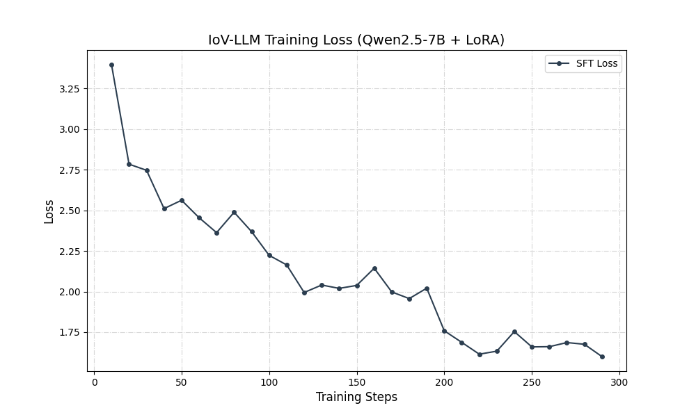

IoV-LLM: 车联网/机器人垂直领域多模态专家系统本系统
是一款基于 Qwen2.5-7B 的垂直领域大模型，专门针对 6G 车联网协议（V2X）和多模态机器人调度（如 VIMA 架构）进行深度定制。通过 SFT (指令微调) 与 RAG (检索增强生成) 的双驱动架构，解决了通用大模型在专业领域下的“知识滞后”与“逻辑幻觉”问题。
🌟 核心亮点
双驱动架构：
融合 SFT 与 RAG，既具备垂直领域的专业语感，又支持基于最新科研论文的实时知识检索。
大算力工程实践：
基于 NVIDIA RTX 5090 (32GB) 环境开发，全程使用 BF16 混合精度 训练，优化了显存利用率。
工程鲁棒性治理：
解决了大规模 PDF 解析中的指令坍缩问题，并成功排查并修复了 NumPy 2.x 与底层算子库的二进制兼容性故障。
🏗️ 系统架构
1. 指令微调 (SFT)基座模型：Qwen2.5-7B。微调算法：LoRA (Low-Rank Adaptation)，设置 $r=64$, $\alpha=128$。训练细节：利用 1.6K+ 条 经过语义重构的车联网指令数据，在 5090 上完成收敛，Loss 从 3.4 降至 1.6。权重合并：通过 Weight Merging 技术将 LoRA 权重熔焊回原模型，确保推理阶段零额外延迟。
2. 检索增强 (RAG)向量库：基于 FAISS-GPU 构建，处理了 3384 个论文知识分片。Embedding：选用 BGE-Small-zh-v1.5，支持中英文学术语境下的高性能语义表征。检索策略：采用 Top-3 召回，通过 Prompt Engineering 引导模型生成带出处的专家级回答。

🛠️ 项目文件结构PlaintextIoV_LLM/
├── data/                 # 存放原始 PDF 论文与处理后的 JSONL 训练集
├── faiss_iov_index/      # 构建好的 FAISS 向量数据库
├── models/               # 存放合并后的 Final 专家模型权重
├── build_kb_final.py     # 具备异常处理与分批逻辑的知识库构建脚本
├── web_expert_demo.py    # 基于 Gradio 的 Web 交互演示系统
├── plot_loss.py          # 训练收敛曲线提取与分析脚本
└── iov_loss_curve.png    # 模型收敛证明（SFT 阶段核心产物）
 
📈 训练表现 (Loss Curve)模型在训练过程中表现出良好的收敛性。
初始 Loss 为 3.4，经过约 300 steps 的迭代，最终稳定在 1.6 附近。曲线平滑下降且后期无抬头，证明 Cosine 学习率调度策略 与 BF16 精度 完美配合，未出现过拟合迹象。

🚀 部署与演示环境恢复：
运行 pip install -r requirements.txt (确保 numpy < 2.0)。
启动 Web 服务：执行 python web_expert_demo.py。
异地访问：系统通过 Gradio FRPC 或 SSH Tunnel 实现了跨地域（北京-新加坡）的实时推理与成果演示。

💡 面试高频问题 (FAQ)
Q: 为什么不直接全参数微调？
A: 在 5090 环境下，LoRA 可以在极小的参数更新下实现精准的领域对齐，且由于我们进行了 Weight Merging，推理效率与全量微调一致，但训练成本大幅降低。
Q: 如何处理 PDF 中的公式和乱码？
A: 开发了启发式清洗脚本，剔除页码与页眉噪声，并手动解决了 Tokenizer 对非 ASCII 字符的校验冲突，保证了数据质量。